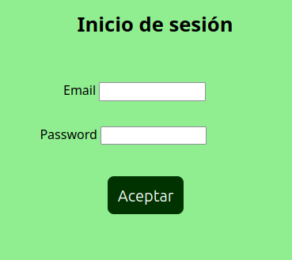
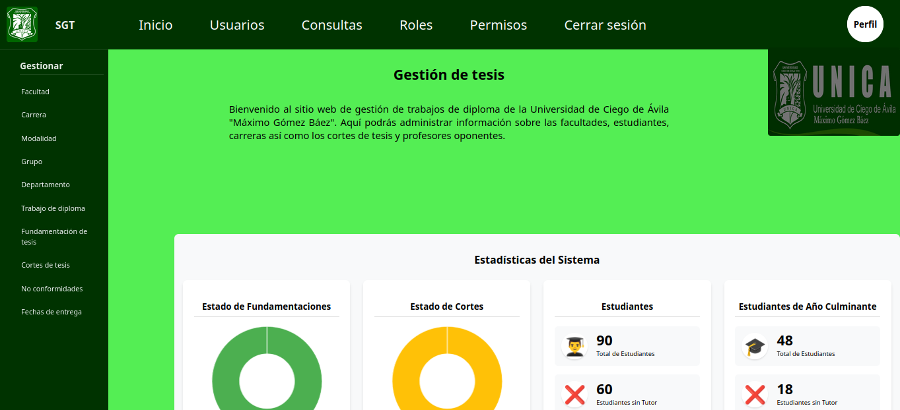
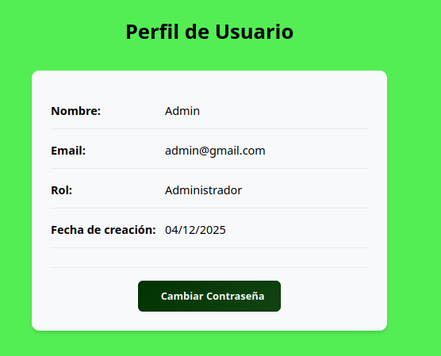
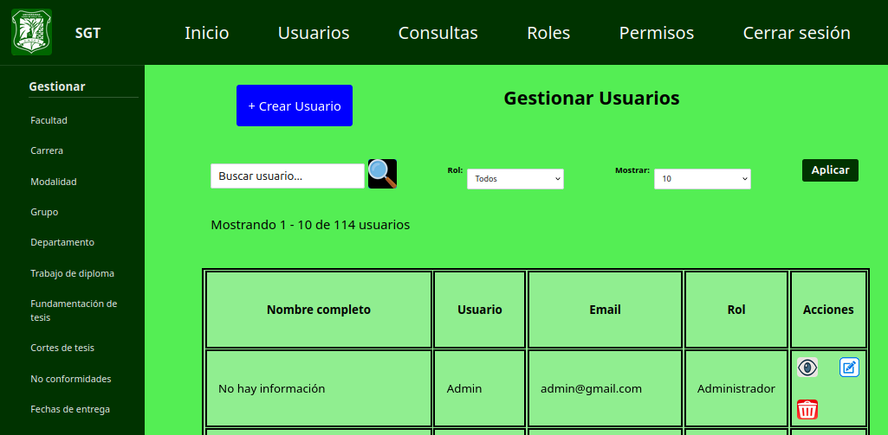
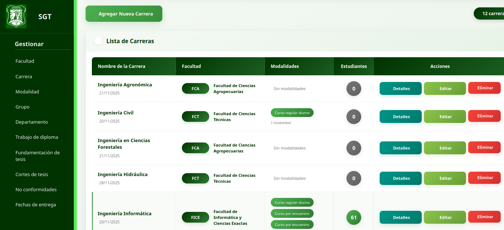
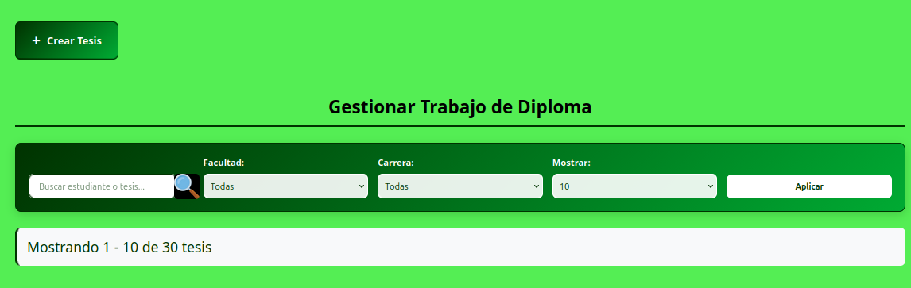
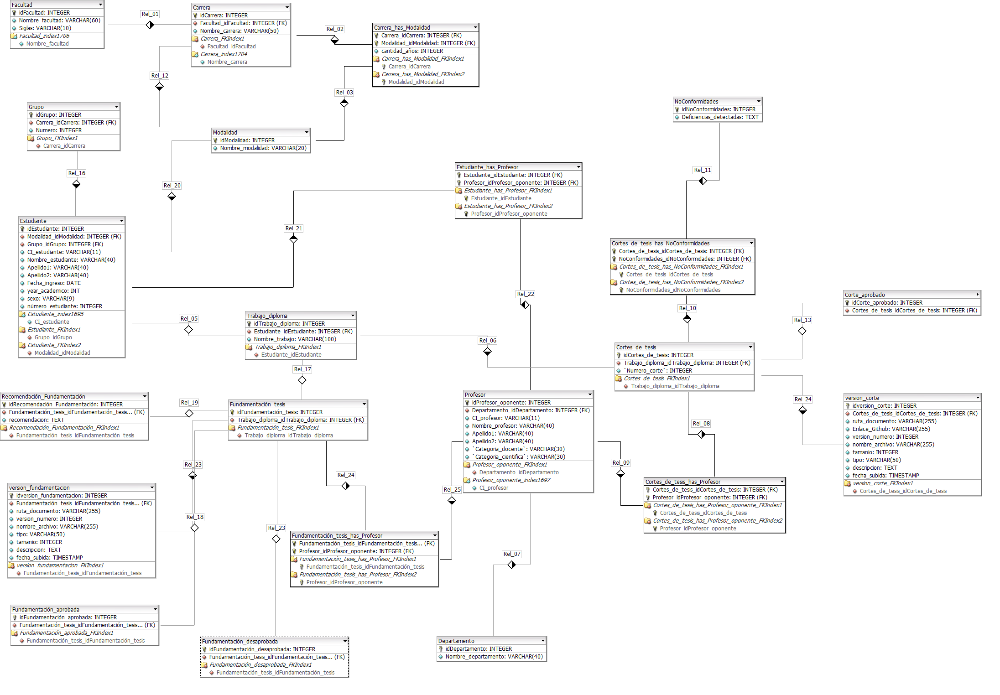

# Sistema de Gestión de Trabajos de Diploma - UNICA

Sistema informático para la automatización de la gestión de los trabajos de diploma en la Universidad de Ciego de Ávila "Máximo Gómez Báez".  
Reemplaza el almacenamiento manuscrito tradicional por una plataforma digital que permite el acceso rápido, evaluación eficiente y seguimiento de las tesis de los estudiantes.

## 📝 Descripción

La mayoría de los datos relacionados con los trabajos de diploma se almacenaban en documentos manuscritos, lo que dificultaba el acceso rápido y la evaluación de las tesis. Este sistema web resuelve esa problemática al centralizar la información y ofrecer roles diferenciados para administradores, estudiantes y profesores.

El desarrollo siguió la metodología ágil **Extreme Programming (XP)**, permitiendo adaptarse a requisitos cambiantes y entregar valor de forma incremental.

## ✨ Características principales

### Módulo de Administrador
- Gestión de usuarios, roles y permisos.
- Gestión de facultades, carreras y modalidades de estudio.
- Asignación de tutor-estudiante.
- Gestión de fundamentaciones, revisión de fundamentaciones por profesor y recomendaciones.
- Gestión de cortes de evaluación, no conformidades y asignación de profesores a cortes.

### Módulo de Estudiante
- Creación y edición de fundamentaciones.
- Subida y gestión de cortes de tesis.

### Módulo de Profesor
- Revisión y retroalimentación de fundamentaciones.
- Evaluación de cortes presentados por estudiantes.

## 🛠️ Tecnologías utilizadas

| Capa          | Tecnologías                                      |
|---------------|--------------------------------------------------|
| Backend       | PHP 8, Laravel 12                                |
| Frontend      | HTML5, CSS3, JavaScript                          |
| Base de datos | MySQL 15.1                                       |
| Herramientas  | Visual Studio Code, DBDesigner (diagramas ER)    |

### Frameworks y librerías destacadas
- **Laravel 12**: Framework PHP con patrón MVC, Eloquent ORM, migraciones, seeders, autenticación integrada.
- **Eloquent ORM**: Interacción fluida y segura con MySQL.


## 🔧 Metodología de desarrollo

Se empleó **Extreme Programming (XP)** por su flexibilidad, iteraciones cortas, colaboración continua con el cliente y capacidad de respuesta ante requisitos cambiantes. Se pudo entregar resultados funcionales de manera rápida y adaptarse a las necesidades institucionales.

## 📋 Requisitos del sistema

- PHP >= 8.1
- Composer
- MySQL >= 5.7
- Node.js & NPM (para assets)
- Servidor web (Apache/Nginx) 

## 🚀 Instalación y configuración


```bash

# 1. Instalar dependencias de PHP

composer install

#2. Instalar dependencias de Node.js y compilar assets

npm install
npm run build   # o npm run dev para desarrollo

#3. Edita .env con los datos de tu base de datos MySQL:

DB_CONNECTION=mysql
DB_HOST=127.0.0.1
DB_PORT=3306
DB_DATABASE=nombre_bd
DB_USERNAME=usuario
DB_PASSWORD=contraseña

#4. Ejecutar migraciones y seeders

php artisan migrate --seed


#5. Iniciar el servidor de desarrollo

php artisan serve

```

```
Estructura del proyecto (principales directorios)
text

app/
├── Http/Controllers/     # Controladores (Admin, Estudiante, Profesor)
├── Models/               # Modelos Eloquent
database/
├── migrations/           # Migraciones de la BD
├── seeders/              # Datos iniciales
resources/
├── views/                # Vistas Blade
routes/
├── web.php               # Rutas principales

```

## Imágenes

**Login**  


**Inicio**  


**Perfil de usuario**  


**Gestionar usuarios**  


**Gestionar carreras**  


**Gestionar Tesis**  


**Modelo lógico**  


