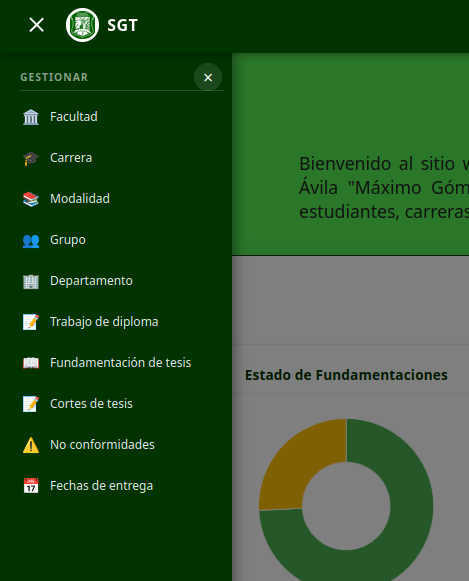
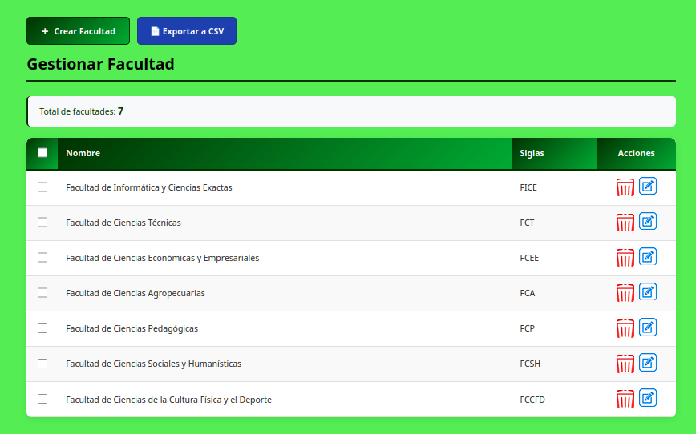
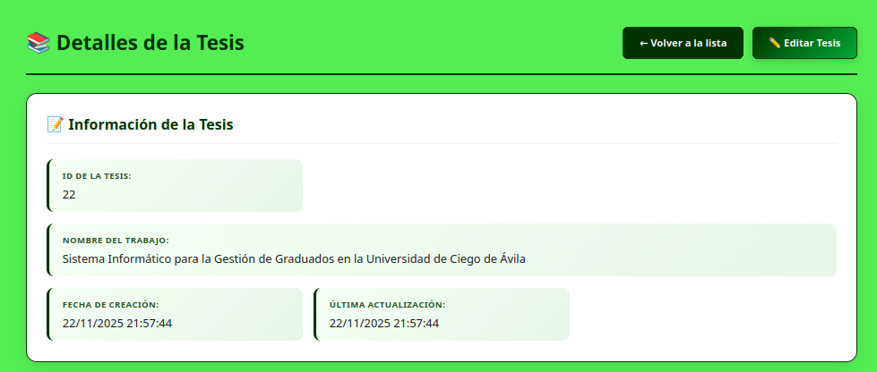
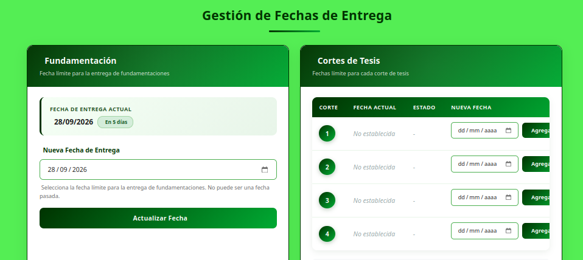

# Sistema de Gestión de Trabajos de Diploma - UNICA

Sistema informático para la automatización de la gestión de los trabajos de diploma en la Universidad de Ciego de Ávila "Máximo Gómez Báez".  
Reemplaza el almacenamiento manuscrito tradicional por una plataforma digital que permite el acceso rápido, evaluación eficiente y seguimiento de las tesis de los estudiantes.

## 📝 Descripción

La mayoría de los datos relacionados con los trabajos de diploma se almacenaban en documentos manuscritos, lo que dificultaba el acceso rápido y la evaluación de las tesis. Este sistema web resuelve esa problemática al centralizar la información y ofrecer roles diferenciados para administradores, estudiantes y profesores.

El desarrollo siguió la metodología ágil **Extreme Programming (XP)**, permitiendo adaptarse a requisitos cambiantes y entregar valor de forma incremental.

## ✨ Características principales

### Módulo de Administrador
- Gestión de usuarios, roles y permisos.
- Gestión de facultades, carreras y modalidades de estudio.
- Asignación de tutor-estudiante.
- Gestión de fundamentaciones, revisión de fundamentaciones por profesor y recomendaciones.
- Gestión de cortes de evaluación, no conformidades y asignación de profesores a cortes.

### Módulo de Estudiante
- Creación y edición de fundamentaciones.
- Subida y gestión de cortes de tesis.

### Módulo de Profesor
- Revisión y retroalimentación de fundamentaciones.
- Evaluación de cortes presentados por estudiantes.

## 🛠️ Tecnologías utilizadas

| Capa          | Tecnologías                                      |
|---------------|--------------------------------------------------|
| Backend       | PHP 8, Laravel 12                                |
| Frontend      | HTML5, CSS3, JavaScript                          |
| Base de datos | MySQL 15.1                                       |
| Herramientas  | Visual Studio Code, DBDesigner (diagramas ER)    |

## Imágenes

**Login**  

**Inicio**  

**Navegación**  

**Perfil de usuario**  

**Gestionar usuarios**  

**Gestionar facultad**  

**Gestionar carreras**  

**Gestionar Tesis**  

**Detalles de una Tesis**  

**Gestionar Fechas de Entrega**  

**Modelo lógico**  

